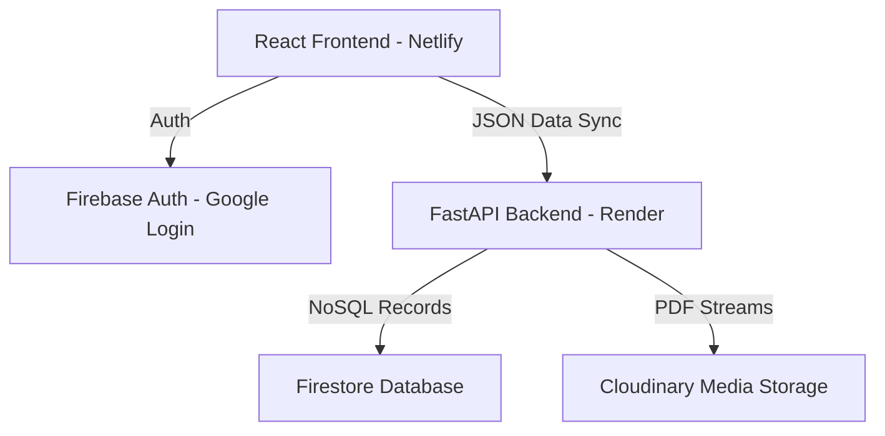

# StudentOS — Premium Academic Hub 🎓

StudentOS is a premium, responsive, single-page academic workspace designed to streamline student life. It features a complete note-sharing vault, a secure personal document locker, task management, an academic calendar, study trackers, and a multi-note scratchpad.

🚀 **Live Site:** [vnitstudenttos.netlify.app](https://vnitstudenttos.netlify.app/)

---

## Key Features 🌟

### 1. Public Department Notes Vault 📁
- Bifurcated note sharing divided by **Department** (Civil, CS, EE, etc.) and **Semester** (Semester 1 to 8).
- Guest students can securely upload notes for review.
- **Admin Approval Portal:** Notes are uploaded as `pending` and are routed to a dedicated Admin Panel (`AdminNoteApprovalPage`) where authorized administrators can review, approve, or delete files.
- **Public ID Deletions:** Deletion privileges are strictly limited to verified admin emails.

### 2. Private Space (Personal Locker) 🔒
- **Personal Notes & Journal Vault:** Private document locker where students can upload and preview study materials securely.
- **Multi-Note Scratchpad:** Interactive rich-text canvas powered by **Quill.js** featuring auto-saving, dynamic notes catalog, and instant title updates.
- **Focus Countdown:** Minimalist Pomodoro timer with progress tracking and ambient background sounds to enhance productivity.

### 3. Study Organization Tools 📅
- **Academic Calendar:** Color-coded calendar to log assignment deadlines, exams, and lab sessions.
- **Task List (To-Do):** Priority-sorted, filterable task manager with local storage cache fallback.
- **GPA Calculator:** Interactive SGPA and CGPA calculators with dynamic row additions.
- **Notice Board:** A real-time pinned notice board for announcements.

---

## Technology Stack 🛠️

- **Frontend:** React.js, TailwindCSS (for modern styling and aesthetics), Quill.js (Rich Text Editor).
- **Backend:** FastAPI (Python), Uvicorn.
- **Database:** Google Cloud Firestore (Firebase).
- **Authentication:** Firebase Authentication (Google Sign-In).
- **File Storage:** Cloudinary API (for secure, cloud-hosted PDF and media storage).
- **Hosting:** Netlify (Frontend) & Render (Backend).

---

## System Architecture 🏗️



### Security & Production Best Practices
- **Credential Protection:** Zero hardcoded API keys. All database credentials and storage tokens are safely configured via Render's cloud environment variables (`FIREBASE_CREDENTIALS`, `CLOUDINARY_API_SECRET`, etc.).
- **Local Dev Fallbacks:** Seamless `.gitignore` policies protecting local configuration files (`.env` and `serviceAccountKey.json`) while maintaining local development capability.
- **CORS Protection:** Configured cross-origin resource policies restricting API requests strictly to trusted production origins.
- **SPA Router:** Implemented client-side Hash Routing to support native browser history (Back and Forward navigation buttons) seamlessly.

---

## Local Setup & Installation 💻

### Backend
1. Navigate to the backend directory:
   ```bash
   cd studentos-backend
   ```
2. Install Python dependencies:
   ```bash
   pip install -r requirements.txt
   ```
3. Set up your `.env` file with your Cloudinary credentials:
   ```text
   CLOUDINARY_CLOUD_NAME=your_cloud_name
   CLOUDINARY_API_KEY=your_api_key
   CLOUDINARY_API_SECRET=your_api_secret
   ```
4. Place your Firebase `serviceAccountKey.json` inside the `studentos-backend` directory.
5. Run the FastAPI development server:
   ```bash
   python -m uvicorn main:app --port 8001 --reload
   ```

### Frontend
Since the frontend is a single-page application compiling JSX via Babel standalone, you can serve the root directory using any local HTTP server:
```bash
python -m http.server 8081
```
Open [http://localhost:8081](http://localhost:8081) in your browser.
